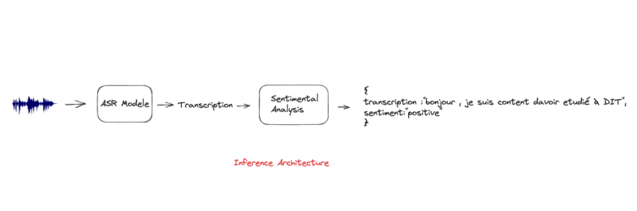

# Automatic Speech Recognition and Sentiment Analysis
Ce projet est composé de deux parties distinctes :  un modèle de Reconnaissance Automatique de la Parole (ASR). et un modèle qui effectue une analyse de sentiment sur la transcription générée par le modèle ASR.

La première partie du projet se concentre sur la mise en place du modèle ASR. Nous avons utilisé un modèle français sur le Hub de Huggingface en inférence pour transcrire des enregistrements audio en texte.

Dans la deuxième partie du projet, nous avons d'abord fine-tuné (bert_sentiment_classification_model.ipynb) un modèle de classification BERT entrainé sur le jeu de données : https://www.kaggle.com/datasets/djilax/allocine-french-movie-reviews. Ensuite, nous l'avons envoyé sur le Hub de Hugging Face (https://huggingface.co/billfass/bert-base-sentiment-classification). Enfin, nous avons effectué une analyse de sentiment sur la transcription générée du modèle ASR.



## Modèle de Reconnaissance Automatique de la Parole (ASR)

Vous pouvez utiliser ce modèle ASR pour transcrire des fichiers audio en langue française en texte écrit. Voici comment l'utiliser dans Python :

```python
from transformers import AutoProcessor, AutoModelForCTC
from transformers import AutoModelForCTC, Wav2Vec2Processor

import soundfile as sf
import torch
import json
import torchaudio

device = torch.device("cuda:0" if torch.cuda.is_available() else "cpu")

model = AutoModelForCTC.from_pretrained("bhuang/asr-wav2vec2-french").to(device)
processor = Wav2Vec2Processor.from_pretrained("bhuang/asr-wav2vec2-french")
model_sample_rate = processor.feature_extractor.sampling_rate

def asr(wav_path):
    """
    Effectue la reconnaissance automatique de la parole (ASR) sur un fichier audio donné 
    en utilisant un modèle Wav2Vec2 pré-entraîné en français.

    Args:
        wav_path (str): Le chemin vers le fichier audio à transcrire.

    Returns:
        str: La séquence de mots prédite à partir du fichier audio.
    """
    waveform, sample_rate = torchaudio.load(wav_path)
    waveform = waveform.squeeze(axis=0)  # mono

    # resample
    if sample_rate != model_sample_rate:
        resampler = torchaudio.transforms.Resample(sample_rate, model_sample_rate)
        waveform = resampler(waveform)

    # normalize
    input_dict = processor(waveform, sampling_rate=model_sample_rate, return_tensors="pt")

    with torch.inference_mode():
        logits = model(input_dict.input_values.to(device)).logits

    # decode
    predicted_ids = torch.argmax(logits, dim=-1)
    predicted_sentence = processor.batch_decode(predicted_ids)[0]

    return predicted_sentence

print(asr("audio/audio.mp3"))
```

## Modèle d'analyse de sentiment (SA)

Vous pouvez effectuer une analyse de sentiment à partir d'une transcription. Voici comment l'utiliser dans Python :

```python
import torch
import torch.nn as nn
from transformers import AutoTokenizer, BertModel

tokenizer = AutoTokenizer.from_pretrained("billfass/bert-base-sentiment-classification")
model = BertModel.from_pretrained("billfass/bert-base-sentiment-classification")

def prediction(sentence):
    """
    Ce code effectue des prédictions de sentiment en utilisant le modèle "billfass/bert-base-sentiment-classification". 
    Le modèle est pré-entraîné pour la classification des sentiments, 
    et extraie l'étiquette de sentiment (positif ou négatif) en fonction de la prédiction du modèle.

    Args:
        sentence (str): phrase dont on veut classifier le sentiment.

    Returns:
        str: Un string contenant le sentiment prédit (positif ou négatif).
    """
    inputs = tokenizer(sentence, return_tensors="pt")
    with torch.no_grad():
        output = model(**inputs)

    logits = output.last_hidden_state
    linear_layer = nn.Linear(768, 2)
    predict = torch.max(linear_layer(logits.view(-1, 768)), dim=1)
    label_pred = predict.indices[torch.argmax(predict.values).item()].item()

    if label_pred == 0:
        sentiment = "positive"
    else:
        sentiment = "negative"

    return sentiment

print(prediction("Encore un film majeur tres mal distribué, comme par hasard... comme si on voulait nous empecher de comprendre comment on peut se faire gangrener par le mal. Est-ce que vous comprenez ? 4,5/5; cinematographiquement parlant."))

```

## Reconnaissance automatique de la parole et analyse des sentiments

Nous avons maintenant écrit une fonction qui prend un fichier audio, le transcrire en texte à l'aide du modèle ASR pré-entraîné, puis prédire le sentiment (positif ou négatif) du texte transcrit à l'aide du modèle BERT pré-entraîné. Le résultat final est un dictionnaire contenant la transcription et le sentiment prédit. Cette fonction effectue les opérations suivantes :

1. **Chargement de l'extrait audio** : La fonction prend en entrée le chemin vers un fichier audio (`wav_path`) que vous souhaitez transcrire et analyser.

2. **Transcription audio (ASR)** : La fonction utilise un modèle pré-entraîné de Reconnaissance Automatique de la Parole (ASR) appelé Wav2Vec2 (modèle `bhuang/asr-wav2vec2-french`) pour transcrire l'extrait audio en texte. Elle charge l'extrait audio depuis le fichier, effectue un échantillonnage (resampling) si nécessaire pour correspondre au taux d'échantillonnage attendu par le modèle, puis normalise les données audio. Ensuite, elle utilise le modèle ASR pour obtenir la transcription du discours.

3. **Analyse de sentiment** : Après avoir obtenu la transcription audio, la fonction utilise un modèle pré-entraîné BERT pour effectuer une prédiction de classification binaire du sentiment. Le modèle BERT évalue si la transcription est positive ou négative. La prédiction du sentiment est basée sur la transcription de l'extrait audio.

4. **Résultats** : La fonction retourne un dictionnaire contenant deux éléments :
   - "transcription" : La transcription de l'extrait audio en texte.
   - "sentiment" : Le sentiment prédit pour la transcription, qui peut être "positive" ou "négative".

# Utilisation
Le fichier utils.py contient une classe où il y a toutes les méthodes précédemment décrittes. Cette classe est importée dans les fichiers main.py et demo.py pour usage.

## Tester le modèle avec Gradio

Exécutez le fichier demo.py pour tester le modèle avec Gradio. Vous aurez un truc comme suit :


## Tester le modèle avec FAST API

Exécutez le fichier main.py pour tester le modèle avec FastApi avec la commande suivante : 


```shell
uvicorn main:app --host 127.0.0.1 --port 8000
```

## La mise en produciton
Vous pouvez déployez le modèle dans un docker. Le fichier Dockerfile vous permet de créer votre image et de déployer le modèle sur un serveur en production. 


## Limitations et Biais

- Entraîné sur un ensemble de données spécifique, il peut ne pas généraliser bien à d'autres types de texte.
- Ce modèle n'est entraîné que pour la langue française.

## Auteurs

- **Bill Fassinou**
- **bill.fassinou@gmail.com**
  
## Remerciements

Un merci spécial à Hugging Face pour avoir fourni la bibliothèque Transformers qui a rendu ce projet possible.

---
